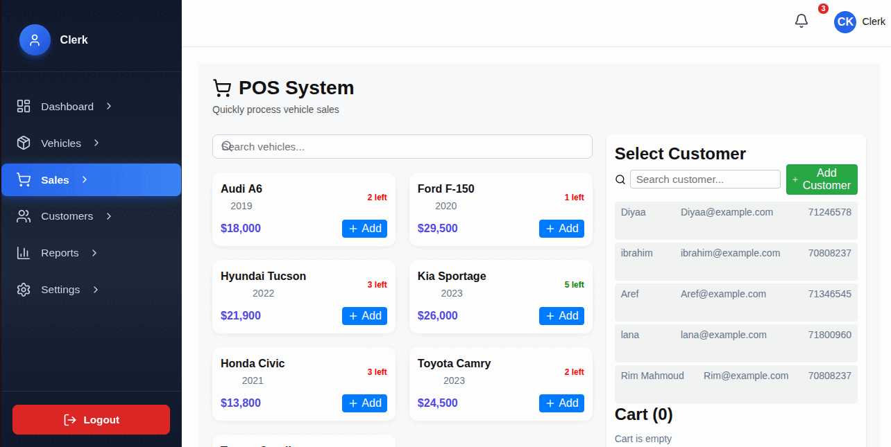

# 🚗 Vehicles Management System

A full-stack **MERN** (MongoDB, Express, React, Node.js) web application that provides a complete **POS and accounting management platform** for vehicle dealerships.  
It offers **role-based dashboards** for Admin, Accountant, and Clerk, allowing seamless management of sales, purchases, inventory, and financial records.

---

## 🎥 Live Dashboard Overview

<p align="center">
  
</p>

<p align="center">
  <i>Admin → Accountant → Clerk dashboards preview</i>
</p>

---

## 🌟 Features

- 🔐 **Role-Based Access Control**
  - Separate dashboards for Admin, Accountant, and Clerk
- 💰 **Point of Sale (POS)**
  - Manage vehicle sales, invoices, and transactions
- 📊 **Accounting Module**
  - Track income, expenses, and profit reports
- 🚘 **Inventory Management**
  - Add, edit, and monitor vehicles (cars, motorcycles, boats)
- 👥 **Customer Management**
  - Track customer details and purchase history
- 📈 **Dynamic Dashboards**
  - Real-time KPIs and charts for financial insights
- 🧾 **Reporting Tools**
  - Generate summaries, transaction history, and analytics

---

## 🛠️ Tech Stack

| Layer | Technologies |
|-------|---------------|
| **Frontend** | React, Vite, React Router, Lucide Icons |
| **Backend** | Node.js, Express.js |
| **Database** | MongoDB + Mongoose |
| **Styling** | CSS (Custom Responsive Styling) |
| **Tools** | Postman, Git, VS Code, JWT Auth |

---

## 📦 Key Backend Dependencies

| Package | Purpose |
|--------|---------|
| **bcryptjs** | Secure password hashing |
| **jsonwebtoken** | Token-based authentication |
| **validator** | Validate and sanitize input |
| **morgan** | Log incoming requests |
| **multer** | Image / file upload handling |
| **mongoose** | MongoDB schema modeling |
| **cors** | Allow frontend → backend communication |
| **dotenv** | Load environment variables |

---

## 🎨 Key Frontend Dependencies

| Package | Purpose |
|--------|---------|
| **axios** | API communication requests |
| **react-router-dom** | SPA navigation & routing |
| **lucide-react** | Modern icons |
| **recharts** | Analytics & Dashboard charts |
| **react-toastify** | Success / Error notifications |
| **classnames** | Conditional styling utility |

---


## 📁 Folder Structure
```


mern-pos-vehicles/
├── client/ # React Frontend
│ └── src/
│ ├── components/ # UI Components (for each role)
│ ├── context/ # React Context Providers
│ ├── pages/ # Accountant, Clerk, Admin Pages
│ └── styles/ # CSS Stylesheets (Custom Responsive, No Tailwind)
│ └── package.json
│
├── server/ # Express + Node Backend
│ ├── models/ # Mongoose Schemas
│ ├── routes/ # API Endpoints
│ ├── controllers/ # Business Logic
│ ├── config/ # Database Connection
│ ├── middleware/ # Auth & Validation Middleware
│ └── package.json
│
└── README.md
```

</details>

---

## 🚀 Getting Started

### 1) Clone Repository
```bash
git clone https://github.com/MohammadBalqis/mern-pos-vehicles.git
cd mern-pos-vehicles

 ##Install Dependencies
 # Backend
cd server
npm install

# Frontend
cd ../client
npm install


Inside the /server folder, create a .env file and add:

MONGO_URI=your_mongodb_connection_string
PORT=5000
JWT_SECRET=your_secret_key


Run the Application:
# Run backend
cd server
npm run dev

# 🔐 Authentication & Security
npm install bcryptjs                 # Password hashing
npm install jsonwebtoken             # JWT authentication
npm install validator                # Input validation

# 🧾 Utilities & Middleware
npm install morgan                   # HTTP request logger
npm install multer                   # File upload handling (optional)


# Run frontend
cd ../client
npm run dev
# 📦 Core Packages
npm install react-router-dom        # Routing and navigation
npm install axios                   # HTTP requests (API calls)
npm install lucide-react             # Modern icon set
npm install recharts                 # Charts for reports and analytics
npm install react-toastify           # Notification popups

# 🎨 UI Framework (choose one)
npm install bootstrap                # If using Bootstrap
# OR
npm install -D tailwindcss postcss autoprefixer
npx tailwindcss init -p              # If using Tailwind CSS

# ⚙️ Optional Utilities
npm install dotenv                   # Environment variables (optional)

Then visit:
👉 http://localhost:5173

📊 Future Enhancements

🔄 Real-time synchronization across dashboards

🧾 Printable receipts and PDF reports

📦 Inventory stock alerts and low-quantity warnings

🧠 AI-based sales and expense predictions

🌐 Deployment with Docker and CI/CD integration


👨‍💻 Author

Mohammad Balqis
🚀 Full-Stack Developer (MERN) | Digital Hub Trainee
📫 GitHub Profile: https://github.com/MohammadBalqis

💼 Passionate about building scalable and data-driven web applications.


📜 License:

This project is open source and available under the MIT License.

🏷️ Badges

---

### ✅ Next Step
1. Copy the above text into a new file named `README.md` inside your project root.  
2. Commit and push:
   ```bash
   git add README.md
   git commit -m "Add project README"
   git push origin main